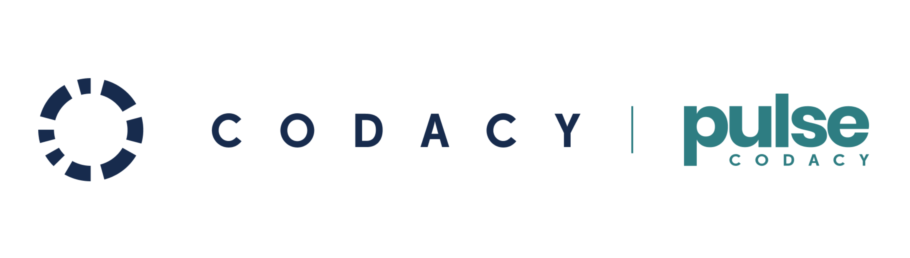
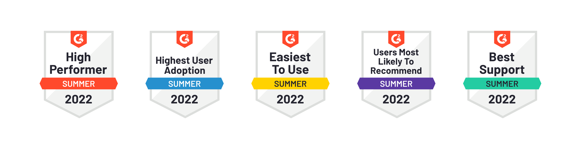

	<strong>The DevOps Intelligence Platform.</strong>

	👉 <a href="https://www.codacy.com/">https://www.codacy.com/</a> 👈

## About Codacy
Codacy automatically analyzes your source code and identifies issues as you go, helping you develop software more efficiently with fewer issues down the line. Through static code review analysis, Codacy notifies you of security issues, code coverage, code duplication, and code complexity in every commit and pull request. 

Ship high-quality code on more than 40 programming languages:

& more.

Create PR gates based on your personal quality rules. Apply code patterns to standardize your code quality across all teams and projects. Identify OWASP Top 10 vulnerabilities, and more. Fully integrated into your workflow, easily set up Codacy with GitHub, GitLab or Bitbucket.

Always free for open source!

-----------------------------------------------------------------------------------------------------------

## Pulse by Codacy
Pulse is a new product that gives you high-level visibility of your organization's performance and the quality of your Engineering practices. Track your DORA metrics (deployment frequency, lead time for changes, mean time to recover and change failure rate) to guide your team to full engineering performance. Integrates with GitHub and Jira.

**[Try Pulse here](https://www.pulse.codacy.com/).**

-----------------------------------------------------------------------------------------------------------

## Documentation

Check out Codacy 📘 docs [here](https://docs.codacy.com/getting-started/codacy-quickstart/) for a quick setup guide, see supported languages and tools, and learn more about Codacy.

🎬 [Quick tour](https://www.youtube.com/watch?v=4hs-5Onqv8k) (video)

Check out Pulse 📘 docs [here](https://docs.pulse.codacy.com/).

-----------------------------------------------------------------------------------------------------------

## Rated #1 Easiest to use Static Code Analysis Tool by G2
Codacy ranks #1 on G2's list of [Top 11 easiest to use SCA tools](https://www.g2.com/categories/static-code-analysis?tab=easiest_to_use).

-----------------------------------------------------------------------------------------------------------

## Contact Us
✉️ Support: support@codacy.com

✉️ Product questions or request a demo: sales@codacy.com

✉️ Sponsorships and partnerships: marketing@codacy.com

-----------------------------------------------------------------------------------------------------------

## Where to find us

